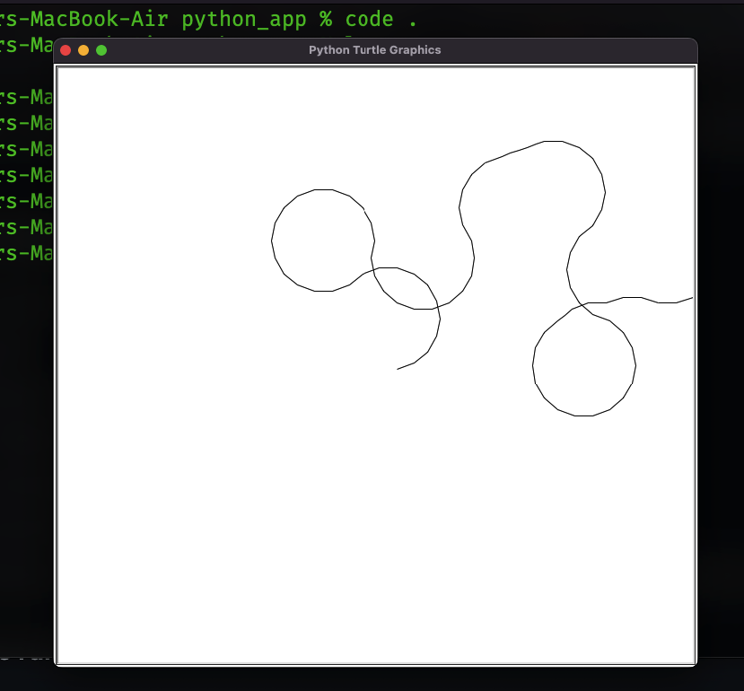

## Turtle Drawing Applications

I'm apply fully oop concept to creating this drawing application

#### Follow this step to creating this awesome application

- [x] 🏛 Create a class called `Drawing`
- [x] 📌 Import Turtle, Screen from `turtle`
- [x] 🪕 Create instance of Screen and Turtle like `screen`, `turt`
- [x] 👈👉🏻 Create left (key=`l`), right (key=`r`) method to handle keybounding
- [x] ☝🏻👇🏻 Create Forward (key=`f`), Backward(key=`b`) method also
- [x] 📺 Create `closeScreen` method for handle screen
- [x] 🏃🏻‍♂️ Create `run` method

#### Application Screenshot

